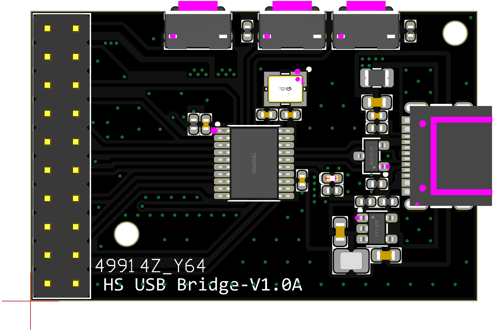
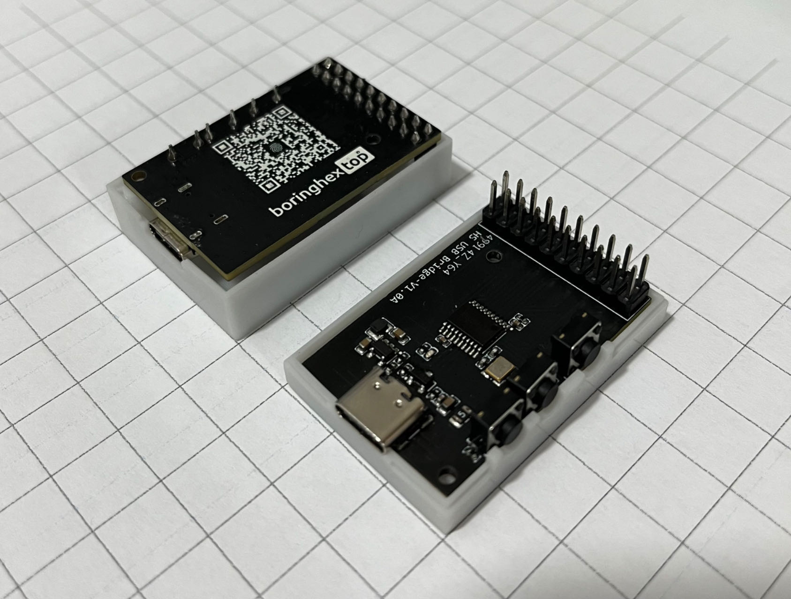
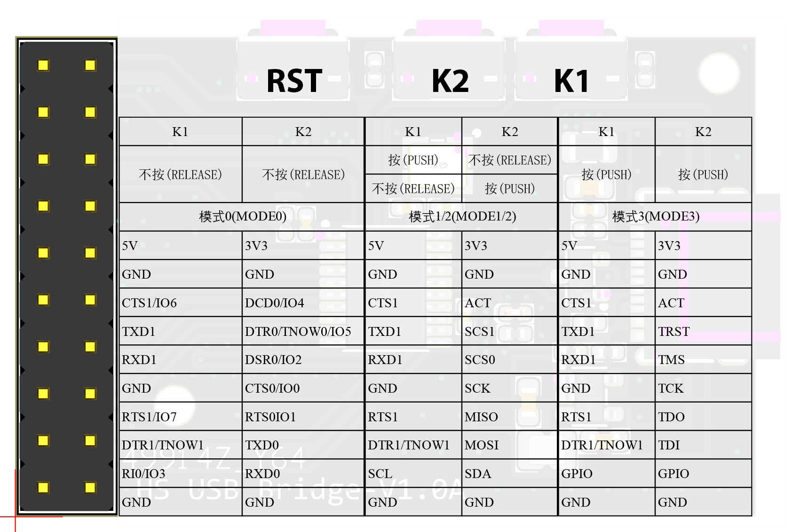

# CH347 USB High Speed Bridge

[English](README_en.md)

## 简介

CH347 USB High Speed Bridge 是基于沁恒[CH347](https://www.wch.cn/products/CH347.html)芯片设计的一款调试利器，支持高速USB，可以实现USB to UART，USB to SPI，USB to I2C，USB JTAG，USB to GPIO。

## 特性

### 概况

- Type-C接口，USB2.0，支持480Mbps高速模式
- 按键切换工作模式，支持热切换，无需插拔USB
- 内置EEPROM，可配置工作模式、芯片VID、PID、最大电流值、厂商和产品信息字符串等参数
- 板载高效率DCDC，支持5V、3.3V电源输出，最大1A电流，带短路保护
- 尺寸小巧，节省空间，易于使用

### UART

- 内置固件，仿真标准串口，用于升级原串口外围设备，或者通过USB增加额外串口
- 计算机端Windows操作系统下的串口应用程序完全兼容，无需修改
- 硬件全双工串口，内置独立的收发缓冲区，通讯波特率支持1200bps～9Mbps
- 串口支持8个数据位，支持奇校验、偶校验以及无校验，支持1或2停止位
- 每个串口内置12K字节的接收FIFO，4K字节的发送FIFO
- 支持常用的MODEM联络信号RTS、DTR、DCD、RI、DSR、CTS
- 支持CTS和RTS硬件自动流控
- 支持半双工，提供串口正在发送状态指示TNOW，可用于控制RS485收发切换
- 通过外加电平转换器件，支持RS232、RS485、RS422等接口

### SPI

- Host/Master主机模式
- 提供SCS线、SCK/CLK线、MISO/SDI/DIN线、MOSI/SDO/DOUT四根信号线
- 支持2根片选信号线，可分时操作2个SPI接口设备
- 支持8位/16位数据结构，支持MSB和LSB传输
- 支持SPI模式0/1/2/3，支持传输频率配置，传输频率可达60MHz
- 支持硬件DMA发送和接收
- 通过计算机API配合，可灵活操作4线接口的FLASH、MCU、传感器等器件

### I2C

- Host/Master主机模式
- 提供SCL和SDA两根信号线，支持4种传输速度
- 通过计算机API配合，可灵活操作2线接口的A/D、D/A、EEPROM和传感器等器件

### JTAG

- Host/Master主机模式
- 提供TMS线、TCK线、TDI线、TDO线和TRST线(可选)
- 支持高速USB数据传输
- 通过计算机API配合，可灵活操作CPU、DSP、FPGA、CPLD、MCU等器件

### GPIO

- 支持最多8路GPIO输入输出功能

## 工作模式

K1、K2按下输出低电平，松开输出高电平。下表'0'表示按下，'1'表示松开。

| K1 | K2 | 模式 | 接口功能                     |
|----|----|----|--------------------------|
| 1  | 1  | 0  | UART0 + UART1            |
| 0  | 1  | 1  | UART1 + SPI + I2C (CDC)  |
| 1  | 0  | 2  | UART1 + SPI + I2C (HID)  |
| 0  | 0  | 3  | UART1 + JTAG             |

工作模式切换：

上电默认为模式0；按住K1再按RST复位，切换到模式1；按住K2再按RST复位，切换到模式2；同时按住K1、K2再按RST复位，切换到模式3。

## PINOUT

## 目录结构

- [原理图](./sch/)
- [PCB](./pcb/)
- [外壳](./3d/)

## 调试记录

1. [CH347动态库封装实例](https://mp.weixin.qq.com/s?__biz=MzA3NzMyNTIyOA==&mid=2651481701&idx=1&sn=2ddf1ce70703550bbcaeb7bed4aa0211&chksm=84ad70a6b3daf9b036b859b8b4c621c7a8db6a32ca1e04bd9369b7dc125e17ed16f3ebddc608#rd)

## 相关项目

- [WIP] [CH347芯片python库](https://github.com/pengwon/pych347)
